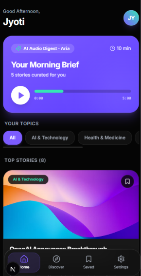
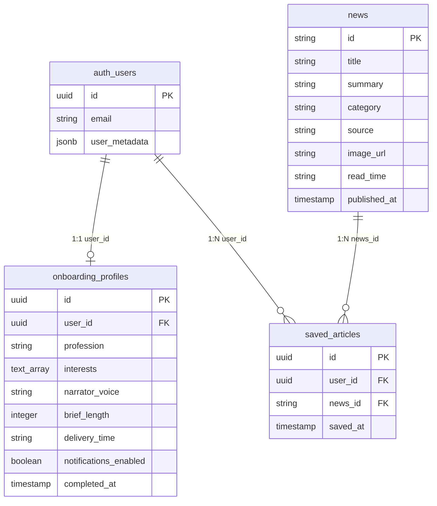

# Nuzio AI — Smart Daily Audio Briefing & Personalized News 🎧



> **Made with heart by [Jyoti](https://github.com/jyotidxt) ❤️**  
> *From a Figma assignment design to a complete, full-stack production-ready mobile web application.*

---

## 🌟 Overview

**Nuzio AI** is a dark-mode mobile-first web application engineered to deliver AI-curated news summaries and daily audio briefings tailored to your profession, interests, and schedule.

Built with **Next.js 15 App Router**, **React 19**, **Tailwind CSS**, and **Supabase (Auth + PostgreSQL + RLS)**, Nuzio AI provides a seamless user journey from initial onboarding to real-time news discovery and bookmark persistence.

---

## ✨ Features

### 🔐 1. Authentication & Security
- **Email Registration with Full Name**: Sign up with full name, email, and password. Full name is stored in Supabase user metadata (`auth.signUp`).
- **Secure Sign In**: Email and password authentication with inline error feedback and toggleable password visibility.
- **Middleware Protection**: Next.js Server Middleware (`src/middleware.ts`) protects authenticated routes (`/home`, `/discover`, `/saved`, `/settings`, `/onboarding/*`) and redirects logged-in users away from auth pages.
- **Session Persistence**: Maintains user auth session across refreshes and app launches.

### 📋 2. Interactive 6-Step Onboarding
1. **Profession Selection**: Choose from 10+ professional tracks (Finance, Tech, Legal, Founder, etc.).
2. **Interest Chips**: Select up to 7 topics that matter to you with real-time selection counters.
3. **Narrator Voice & Duration**: Pick your preferred AI narrator (Aria - British Warm, Kai - American Focused, Meera - Indian Bright) and audio brief length (5 min, 10 min, 15 min).
4. **Delivery Time**: Set your preferred daily delivery schedule with an iOS-style wheel time picker.
5. **Lockscreen Notifications**: Customize morning brief and breaking story notification preferences.
6. **Completion Summary**: Personalized completion card (`"You're ready, [Full Name]."`), storing `completed_at` timestamp in Supabase `onboarding_profiles`.

### 📰 3. Home Screen (`/home`)
- **Dynamic Time-of-Day Greeting**: Adapts dynamically (`Good Morning`, `Good Afternoon`, `Good Evening`) with full user name.
- **Morning Brief Hero Card**: Premium purple gradient hero featuring narrator voice, audio duration, play/pause preview, and animated audio progress.
- **Interest Chips Bar**: Filter news feed by onboarding topics.
- **AI-Curated News Feed**: Article cards with high-res thumbnails, category badges, 2-line summaries, sources, read times, and instant bookmarking.
- **Bottom Navigation**: Floating glassmorphic bottom navigation bar with active tab glow effects.

### 🔍 4. Discover Screen (`/discover`)
- **Real-Time Search**: Instant client-side filtering across article headlines, summaries, categories, and news sources.
- **Category Chips**: Horizontally scrollable chip filter (AI, Tech, Business, Science, Politics, etc.).
- **Trending Section**: View high-impact trending news stories.
- **Empty State**: Custom SVG illustration with a `"Clear Search"` action when no articles match search terms.

### 🔖 5. Saved Screen (`/saved`)
- **Read Later Library**: Displays bookmarked stories for the current authenticated user.
- **Instant Removal**: Delete bookmarks directly from saved cards with optimistic UI updates.
- **Supabase Sync**: Database operations backed by `saved_articles` with composite uniqueness `(user_id, news_id)`.
- **Empty State**: Custom illustration with `"Explore Discover"` CTA button when library is empty.

### ⚙️ 6. Settings Screen (`/settings`)
- **Account Card**: View profile initials, name, and email.
- **Inline Name Editor**: Edit and update display name in real-time via `supabase.auth.updateUser()`.
- **Reading & Notification Preferences**: Toggle morning brief and breaking news alerts.
- **Logout Action**: Clears Supabase auth session and local storage, redirecting safely to `/login`.

---

## 🛠️ Tech Stack

| Domain | Technology |
| :--- | :--- |
| **Framework** | Next.js 15.5 (App Router) |
| **Language** | TypeScript (Strict Mode) |
| **UI Styling** | Tailwind CSS + Lucide Icons |
| **Animations** | Framer Motion |
| **Backend / Auth** | Supabase Auth & SSR |
| **Database** | Supabase PostgreSQL with Row-Level Security (RLS) |

---

## 🗄️ Database Architecture



---

## 📂 Project Structure

```text
NuzioAI/
├── img/
│   └── nuzioAI.png             # Application preview banner
├── src/
│   ├── app/
│   │   ├── discover/           # Discover search & trending feed
│   │   ├── home/               # Home screen with audio brief hero
│   │   ├── language/           # Language selection route
│   │   ├── login/              # Email authentication page
│   │   ├── onboarding/         # 6-step onboarding flow
│   │   ├── saved/              # Bookmarked stories library
│   │   ├── settings/           # User profile & preferences
│   │   ├── signup/             # Account creation with Full Name
│   │   ├── splash/             # Launch screen & auth check
│   │   ├── layout.tsx          # Root layout & dark theme provider
│   │   └── not-found.tsx       # 404 page
│   ├── components/
│   │   ├── navigation/         # BottomNavigation component
│   │   └── ui/                 # Button, Card, Chip, Input, Progress
│   ├── lib/
│   │   ├── news.ts             # News API & Supabase saved_articles helpers
│   │   ├── onboarding-context.tsx # Onboarding React Context & Supabase sync
│   │   ├── supabase.ts         # Supabase client configuration
│   │   └── utils.ts            # Tailwind classnames utility
│   └── middleware.ts           # Next.js Server Middleware route guards
├── next.config.ts              # Next.js configuration
├── tailwind.config.ts          # Tailwind styling configuration
└── README.md                   # Project documentation
```

---

## 🚀 Getting Started

### Prerequisites
- **Node.js**: v18.0.0 or higher
- **npm**: v9.0.0 or higher
- **Supabase Account**: A active Supabase project with Auth & Database enabled.

### 1. Clone the Repository
```bash
git clone https://github.com/jyotidxt/NuzioAI.git
cd NuzioAI
```

### 2. Environment Setup
Create a `.env.local` file in the root directory:
```env
NEXT_PUBLIC_SUPABASE_URL=https://your-supabase-project.supabase.co
NEXT_PUBLIC_SUPABASE_ANON_KEY=your-supabase-anon-key
```

### 3. Install Dependencies
```bash
npm install
```

### 4. Run Development Server
```bash
npm run dev
```
Open [http://localhost:3000](http://localhost:3000) in your browser.

### 5. Production Build
```bash
npm run build
```

---

## 🎨 Design System

- **Background**: Dark `#050505`
- **Surface Cards**: Glassmorphic `#181818` / `#111111` with `border-white/[0.08]`
- **Primary Brand Color**: Purple `#7C5CFF`
- **Accent Highlight**: Mint Green `#35E6B5`
- **Muted Text**: `#9CA3AF`
- **Typography**: Inter Font with high-contrast legibility

---

## ❤️ Acknowledgements

Special thanks to the open-source community, Next.js, and Supabase teams for the amazing tools.

> **"Built with dedication from Figma design to a fully functioning full-stack application." — Jyoti**
